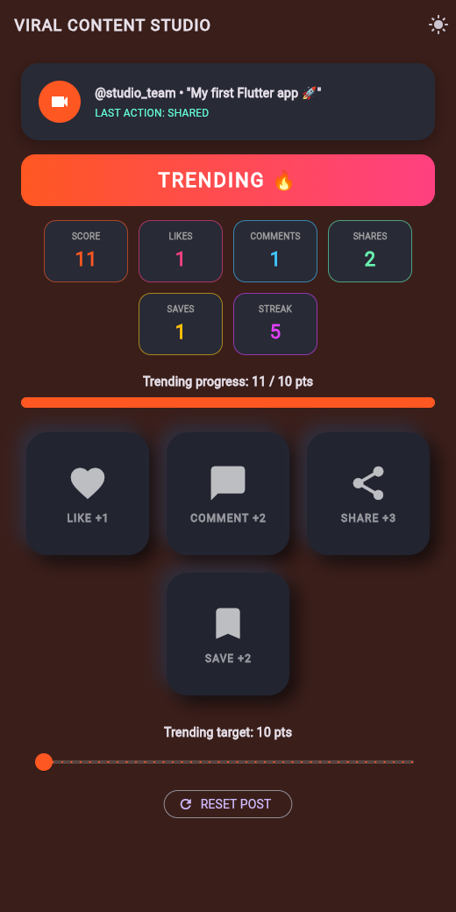
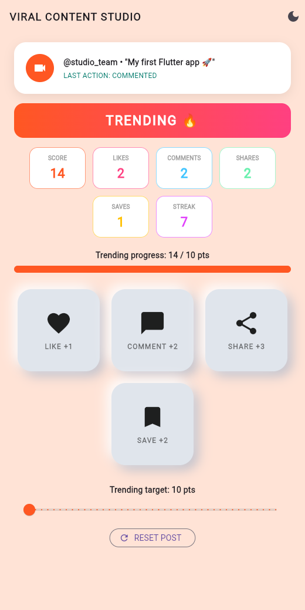
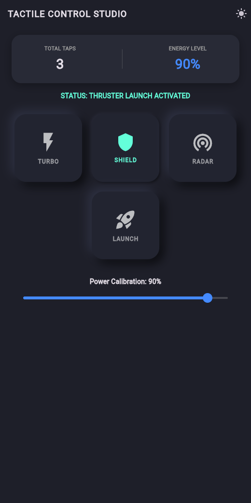

# Activity 04: Flutter Widget Wars & State Derby

## Team Members

Team Name: TODO

- TODO Full Name (Student ID: TODO)
- TODO Full Name (Student ID: TODO)

Google Doc: TODO link

## How to Run

```bash
flutter pub get
flutter run -d chrome
flutter test
```

To run the fixed Round 2 app:

```bash
flutter run -d chrome -t lib/round2_bug_hunt_fixed.dart
```

## Build Challenge

Our theme is the Viral Content Studio. It's a fake social media post where you can like, comment, share, and save to build up points.

Points: Like = 1, Comment = 2, Share = 3, Save = 2.

State variables (in `_ContentStudioScreenState`):

- `likes`, `comments`, `shares`, `saves` (int) - how many times each button was pressed
- `streak` (int) - how many actions in a row since the last reset
- `trendingTarget` (double) - how many points you need to trend. Starts at 20 and you can change it with the slider (10 to 50)
- `lastAction` (String) - the last thing that happened, shown on the post card

The total score and whether the post is trending are worked out from the counters every time the screen builds, so they always match.

The condition: when the score reaches the trending target, the background turns orange, the progress bar turns orange, and a "TRENDING 🔥" banner shows up. The Reset Post button sets everything back to 0.

How we covered each checkpoint:

1. Stateless widgets: `PostHeaderCard`, `MetricBadge`, `TrendingBanner`
2. Custom Stateful widget: `EngagementPad`
3. Buttons: the 4 engagement pads and Reset Post
4. Counter/meter: the number badges and the progress bar, both updated with `setState()`
5. Theme switcher: light/dark button in the top bar
6. GestureDetector: the pads shrink a little and the shadow changes so they look pushed in

Screenshot after it starts trending (score 11, target 10):

 

Demo: [evidence/TeamName-Demo.gif](evidence/TeamName-Demo.gif)

## State Defense

`PostHeaderCard`, `MetricBadge`, and `TrendingBanner` are stateless. They just show whatever values they get from the screen and don't keep track of anything. `ViralStudioApp`, `ContentStudioScreen`, and `EngagementPad` are stateful because they each hold something that changes. The app holds dark/light mode, the screen holds the counters and the target, and each pad holds whether it's being pressed. We kept the pressed value inside each pad so pressing one pad doesn't affect the others. The counters are on the screen because a lot of different widgets need to show them.

Every change goes through `setState()`. That includes pressing a pad, moving the slider, resetting, and switching the theme. `setState()` tells Flutter something changed, so it rebuilds that widget and everything under it. When a pad is held down, only that pad rebuilds. When an action happens, the whole screen rebuilds and the badges, progress bar, and banner all get the new numbers at the same time. If you change a variable without `setState()`, the value changes but the screen doesn't update. That was Bug 2 in Round 2.

The dark/light setting is stored at the top of the app in `ViralStudioApp`, because `MaterialApp` needs it too, not just the screen. The app passes `isDark` down to the screen, and the screen calls `onToggleTheme` when the button is pressed so the app can flip it. The pads work the same way. A pad doesn't know anything about points. It just calls `onPressed` when you let go, and the screen decides what that means. That way we can reuse the same pad widget for all four buttons.

## Round 1 Findings

TODO: paste the team score report from the Round 1 quiz.

## Round 2 Bug Fixes

The full write-ups with screenshots are in our Google Doc (link at the top). The fixed code is in [lib/round2_bug_hunt_fixed.dart](lib/round2_bug_hunt_fixed.dart). We left the original `// 🐛 BUG #` comments in so you can find each fix.



In this screenshot SHIELD is being held down and looks pushed in while the other buttons stay up. The slider is at 90% and Energy Level matches it. Total taps is still 3 because the held button doesn't count until you let go.

### Bug 1: Scope Failure

Pressing one button made all four buttons go down.

```dart
// removed bool isPressed = false; from _ControlDeckScreenState
class _TactileButtonState extends State<TactileButton> {
  bool isPressed = false;
```

Why it works: there was only one `isPressed` on the screen and every button was using it. Now each button has its own, so only the one you press goes down.

### Bug 2: Silent Mutator

Moving the slider didn't update anything on the screen.

```dart
onChanged: (newVal) => setState(() => powerLevel = newVal),
```

Why it works: the value was changing but Flutter didn't know it needed to redraw. Putting it inside `setState()` makes the slider and the percentage update.

### Bug 3: Geometry Inversion

The buttons looked like they popped up when pressed instead of going down.

```dart
boxShadow: isPressed
    ? [ /* Offset(2, 2), Offset(-2, -2), blurRadius 4 */ ]
    : [ /* Offset(8, 8), Offset(-8, -8), blurRadius 16 */ ],
```

Why it works: the two shadow lists were swapped. A small shadow looks pushed in and a big shadow looks raised, so we switched them back.

### Bug 4: Event Race

The action happened as soon as you touched the button, and the button never stayed down.

```dart
onTapDown: (_) => setState(() => isPressed = true),
onTapUp: (_) {
  setState(() => isPressed = false);
  widget.onPressed();
},
onTapCancel: () => setState(() => isPressed = false),
```

Why it works: `onTapDown` was running both the press and the release code at once. Now touching only pushes the button down, letting go runs the action, and dragging off cancels it without running anything.
