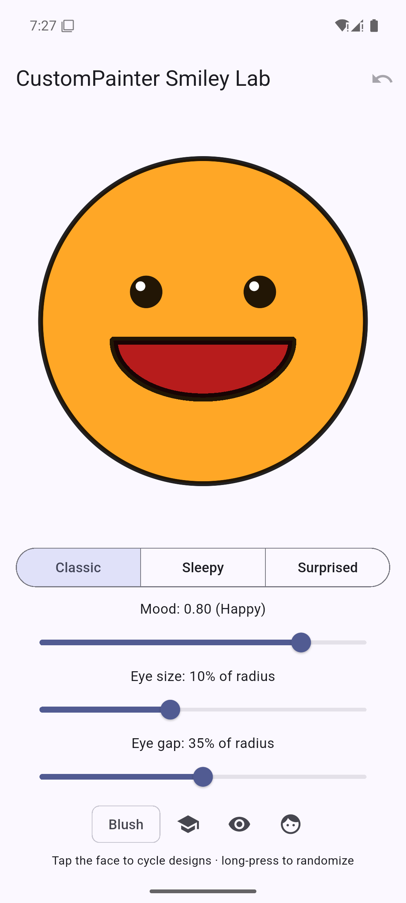
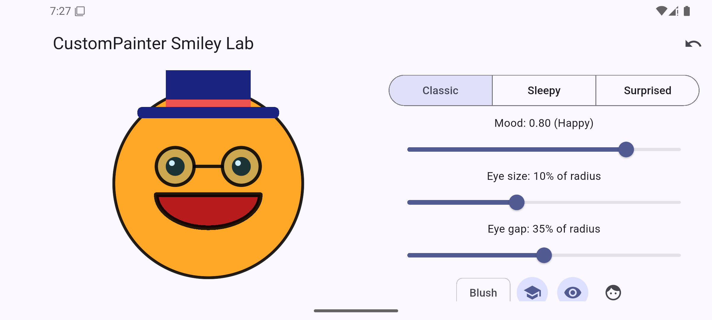
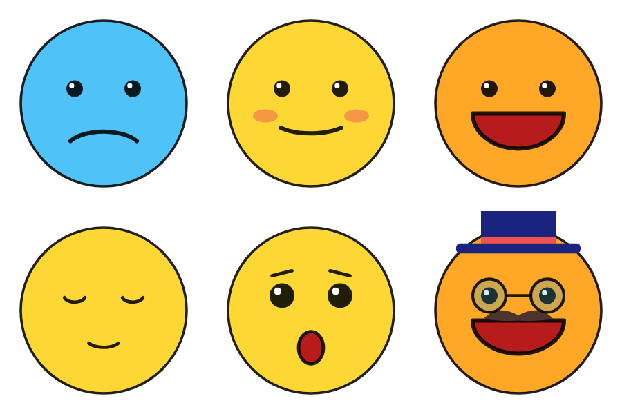

# Activity 06 — Critical Thinking (Undergraduate)

**Student:** Mario Gutierrez

## Measure and improve your smile arc

My painter measures everything from the canvas size. The face center is
`c = Offset(size.width / 2, size.height / 2)`, and the radius is
`r = size.shortestSide * 0.40`. That way the circle always fits inside the
smaller side of the canvas. The happy mouth uses
`Rect.fromCenter(center: Offset(c.dx, c.dy + r * 0.12), width: r * 1.1, height: r * (0.6 + (mood - 0.7)))`
with `drawArc(rect, 0, pi, ...)`. That arc starts at 3 o'clock and sweeps
half a circle clockwise, through 6 o'clock, so it draws the bottom half of
the oval as the smile. The soft smile uses start `0.2 * pi` and sweep
`0.6 * pi`. The frown moves the rect down to `c.dy + r * 0.55` and starts at
`1.15 * pi`, so it draws the top of the oval instead. On the phone emulator
the mouth stayed centered under the eyes in both portrait and landscape.
Changing the mood slider moved it between the frown, the soft smile, and the
big open smile, and the face color changed from blue to yellow to orange.

To keep the app responsive, I changed the eye size and eye gap controls from
fixed pixels (the guide's `eyeRadius = 14`) to fractions of the face radius
(`r * 0.10` and `r * 0.35` by default). Because of that, the eyes shrink
along with the face when the canvas gets smaller in landscape. I also used
an `OrientationBuilder`. In portrait it stacks the face above the controls,
and in landscape it puts them side by side. The face sits inside an
`AspectRatio(1)`, so it never gets squashed.

`shouldRepaint` returns `oldDelegate.config != config`. `FaceConfig`
compares every value the painter reads: mood, face color, eye size, eye
gap, blush, face type, hat, glasses, and mustache. It should return true
when the mood changes, because the mouth shape and face color depend on
the mood and the old pixels would be wrong. It should return false when
nothing changed, because repainting would draw the exact same picture
again and waste work.

**Emulator screenshots** (Pixel 7 emulator, Android 15, release APK):
portrait shows the Classic face at mood 0.80. Landscape shows the same face
with the hat and glasses on, next to the controls.

**Supporting render:** `docs/painter_render.png` shows the painter's output
for sad, neutral + blush, happy, sleepy, surprised, and all accessories.
It was drawn by calling `SmileyPainter.paint` directly in a test, not taken
on the emulator.

